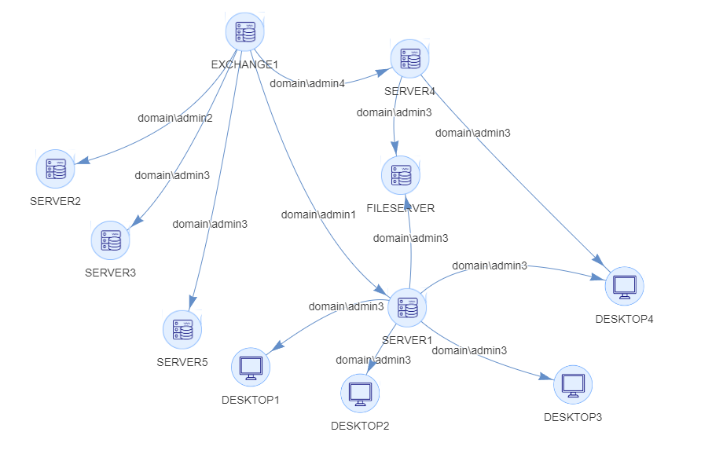

# lateral_movement_graph

Quick script to create directed graphs based on simple fields.




 Fill out `connections.csv` using the following fields:
 - Source Host
 - Destination Host
 - Username
 - Source Host Image
 - Destination Host Image
 
 
## Installation
 ```python3
 pip3 install pyvis
 ```
 
 ## Run
```python3
python3 latmov_pygraphviz.py
```

## Results
Open `lateral_movement.html` to view the results and modify the sliders if needed. 
